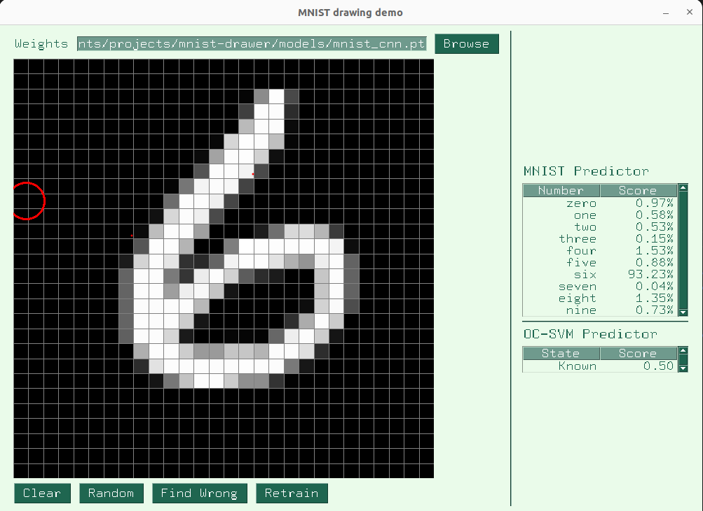

# MNIST-drawer

Draw handwritten digits yourself and classify them in *real-time* on the MNIST dataset. We provide a Graphical User Interface (GUI) and a pre-trained neural network model (written in PyTorch) to do the heavy lifting for you.



Inspired by Sebastian Lague's wonderful YouTube channel and video: https://www.youtube.com/watch?v=hfMk-kjRv4c

## How to use

Clone this repository, load the requirements and call:

```python
python -m mnist_drawer
```

Alternatively the GUI can be called directly:

```python
from mnist_drawer import MNISTApplication
# initialise the GUI
app = MNISTApplication()
# start the main event loop
app.mainloop()
# close the window
app.window.close()
```

This should open a GUI for you to play with. You can:

* draw on the canvas with the left-click 
* erase with the right click
* scroll with the mouse wheel to increase or decrease the brush size. 

Random samples from MNIST can be fetched with the *Random* button. By clicking the *Retrain* button opens a second window where you can re-train the CNN if desired:


The One-Class SVM model can be retrained using `python oneclasssvm.py`.

## Requirements

- Python 3.x
- `pytorch`
- `pysimplegui`
- `numpy`
- `scikit-learn`

Use the requirements file as `pip install -r requirements.txt`.

## Installation

Follow the instructions below:

```
conda create -n mnist_drawer pip numpy scipy scikit-learn
conda activate mnist_drawer
pip3 install -r requirements.txt
pip3 install torch torchvision --index-url https://download.pytorch.org/whl/cu118
pip3 install torchinfo PySimpleGUi
```

## License

This repository is licensed under MIT and is free to use.